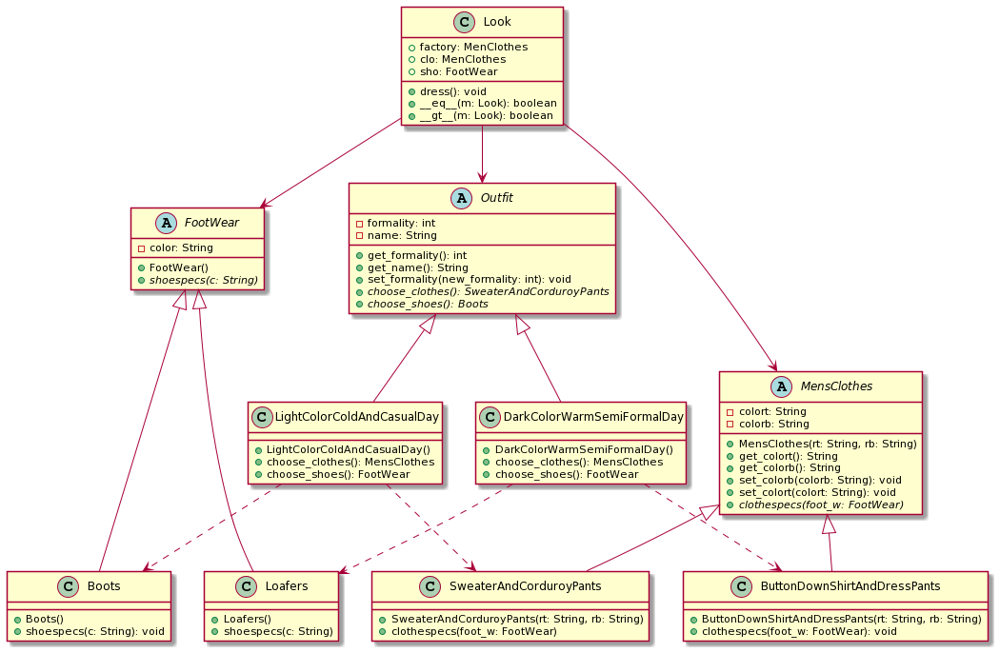

# Abstract factory example in Python
This is an example that you can read in [towardsdatascience.com](https://towardsdatascience.com/python-factories-for-scalable-reusable-and-elegant-code-1358ea06936d),
but with less attributes, static typing and take more advantage of OOP. Additional, a class diagram for the project:

Implemented on Python 3.9+

Have fun ;)